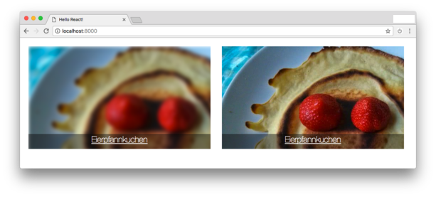
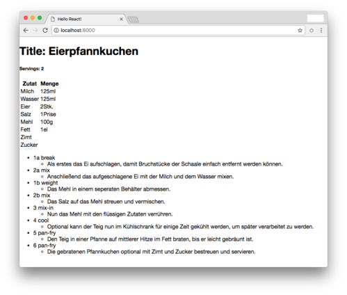

# Web-Tech 2 Projekt (Rezept-Seite)
### Setup
```
npm install;
./node_modules/.bin/webpack;
For python-version less than 3: python -m SimpleHTTPServer;
For python-version higher than 3: python -m http.server;
```

### Todo

General:

* Proper build progress (watch -> compile)
* Tasklist
* Assign Tasks to team-members
* Add react conform licence
  ...

Pages:

* Public
  * Frontpage
  * SearchResult
  * ReceiptView
* Post-Login
  * UserFrontpage
  * ReceiptEditPage (=NewReceiptPage)

Elements:

* Menubar
  * Searchbar
    * SearchSuggestionsDropDownOverlay
      * SearchSuggestionsDropDownOverlayItem
  * PageSelector
  * LoginBox
    * `<input>`
      * Username
      * Password
      * Login-Button
* ReceiptPreview
  * ReceiptPreviewOverlay
  * ReceiptPreview-``
* ReceiptViewer
  * IngredientTable
    * IngredientItem
  * InstructionList
    * InstructionItem
  * Title
  * Servings
  * …?
* ReceiptEditor
  * MetadataEditor (Title, Servings, ...)
  * InstructionEditor
  * IngredientEditor
  * PreviewView

### WIP Images



- ReceiptPreview



* ReceiptView

### Notes
Get missing type definition for new modules

```
npm install -D @types/module-name
```
